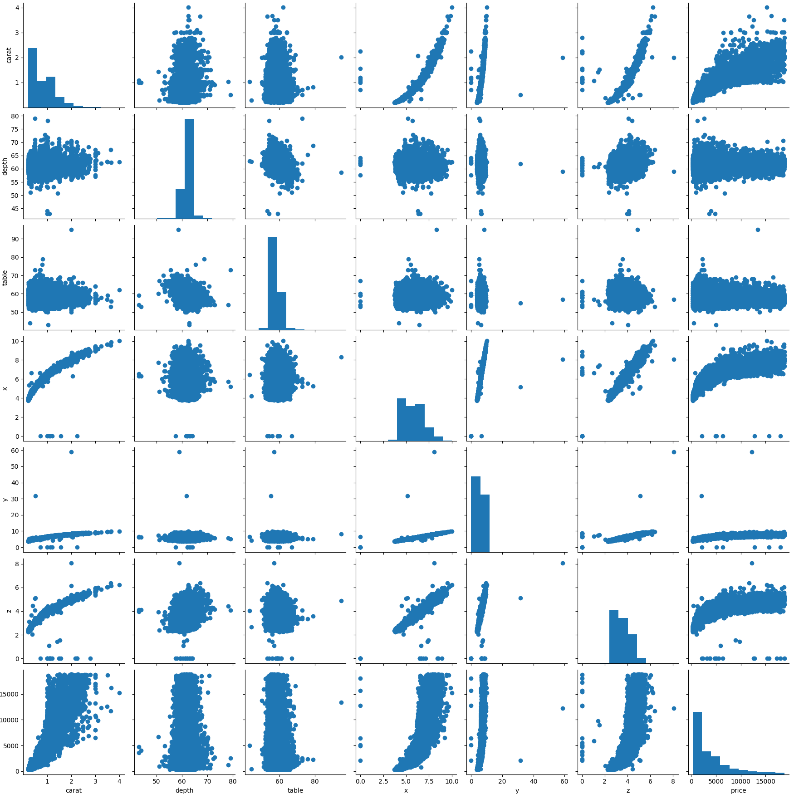
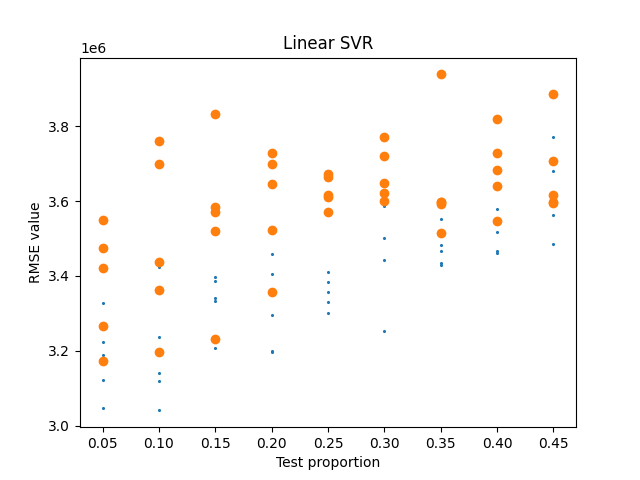
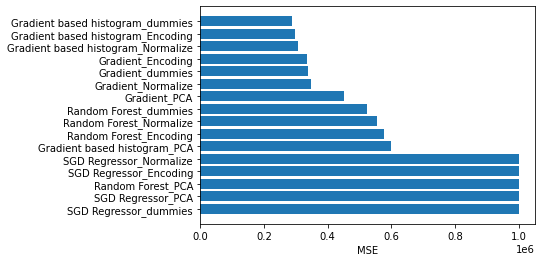
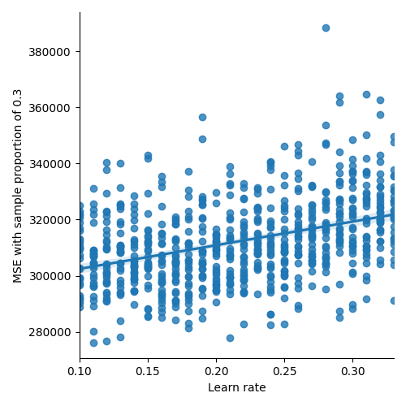

# kaggle-diamonds

Kaggle competition to forecast the value of a diamond from their characteristics

---
## The Bases

The [bases](https://www.kaggle.com/c/diamonds-datamad0320) of the competition are:

*Goal*: Forecast the price of diamonds based on their characteristics.

*Evaluation criteria*: RMSE (Root Mean Squared Error).

>
> This repo contains the code for respond this challenge
>

---
## The Data

The data supplied are three tables:

+ `diamonds_test.csv` -> 10 columns included index, three of the not numeric (13449)
+ `diamonds_train.csv` -> 11 columns included index, three of the not numeric (40345)
+ `sample_submision.csv` -> two columns, one id and two the price

The columns of the data are:

   -  carat `numeric` - unit of mass equal to 200 mg.
   -  cut    `categorical`  - Style and quality of the cutting, it affect the brillance
   -  color  `categorical`  - letter to label the color of the diamond from D to J 
   -  clarity `categorical` - visual appearance of internal characteristics of a diamond
   -  depth   `numeric`     - relation between the depth and the width 
   -  table  `numeric`  - refers to the flat facet of the diamond 
   -  x,y,z `numeric`     - dimensions 
   -  price `numeric`     

For the numerical data we can make a scatter graph:

---
## Preprocess

> The preprocess were implemented in the data_cleaning.py and cleaning_functions.py
> The process can be called including the option `--data_c_t`

The output of this step are differents input for models with: dummies, categorical variables, normalization and filter the outlayers. 

The outlayers where found in variable `y`, in consequence two registers were excluded 

### Categorical and dummy generation

There are three variables categoricals, that were transform in dummy and
categorical form: cut, color and clarity.

The modifications made in this stage includes the test data.

---
## The Models

>
> The models can be called with the option `--model` follow by the corresponding number 
>

The models used were:

- Linear: In the following graph you can see the performance of the model with two different input, the 
orange are encoding in integer the categorical variables, and the blue is converting this to dummies. 

- SRV_rbf: 

The following models perform much better than the previuos.

> --resume option to execute the run the models with differents inputs

- Random forest regession
- Gradient boosting regressor
- SGD Regressor 
- Histogram based gradient boosting regressor

---
> The best model was `(HGBR) Histogram Based Gradient Boosting Regressor`. In consequence the tuning was made over it.

In the following graph it possible appreciate for which `learn_rate` the model perfom better:

> --hist_deep option to run several times the HGBR with learn values between (0.1 - 0.35)

